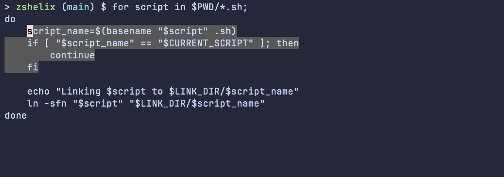

# zshelix

This plugin provides a (currently minimal) set of Helix keybindings for Zsh.

## Installation

TODO

## Keybindings

### Normal Mode

| Key | Description | Function |
|-----|-------------|----------|
| `h` | Move left | move_char_left |
| `j` | Move down (or forward through history) | move_visual_line_down |
| `k` | Move up (or back through history) | move_visual_line_up |
| `l` | Move right | move_char_right |
| `a` | Insert after selection (append) | append_mode |
| `A` | Insert at the end of the line | insert_at_line_end |
| `i` | Insert before selection | insert_mode |
| `I` | Insert at the start of the line | insert_at_line_start |
| `y` | Yank selection | yank |
| `c` | Change selection (delete and enter insert mode) | change_selection |
| `d` | Delete selection | delete_selection |
| `p` | Paste after selection | paste_after |
| `P` | Paste before selection | paste_before |
| `r` | Replace with a character | replace |
| `R` | Replace with yanked text | replace_with_yanked |
| `w` | Move next word start | move_next_word_start |
| `W` | Move next WORD start | move_next_long_word_start |
| `b` | Move previous word start | move_prev_word_start |
| `B` | Move previous WORD start | move_prev_long_word_start |
| `e` | Move next word end | move_next_word_end |
| `E` | Move next WORD end | move_next_long_word_end |
| `gh` | Go to the start of the line | goto_line_start |
| `gl` | Go to the end of the line | goto_line_end |
| `gs` | Go to first non-whitespace character of the line | goto_first_nonwhitespace |
| `gg` | Go to line number <n> else start of file | goto_file_start |
| `ge` | Go to the end of the file | goto_last_line |
| `u` | Undo change | undo |
| `U` | Redo change | redo |
| `x` | Select current line, if already selected, extend to next line | extend_line_below |
| `X` | Extend selection to line bounds (line-wise selection) | extend_to_line_bounds |
| `;` | Collapse selection onto a single cursor | collapse_selection |
| `Alt-;` | Flip selection cursor and anchor | flip_selections |
| `%` | Select entire file | select_all |
| `v` | Enter select (extend) mode | select_mode_flip |
| `Esc` | Switch to normal mode | normal_mode |
| `Enter` | Run the command in the buffer | accept_line |
| `Ctrl-l` | clear the current buffer | clear-screen |
| `Ctrl-p` | Move up (or back through history) | move_visual_line_up |
| `Ctrl-n` | Move down (or forward through history) | move_visual_line_down |

### Insert Mode

| Key | Description | Function |
|-----|-------------|----------|
| `Esc` | Switch to normal mode | normal_mode |
| `Alt-b` | Move previous word start | move_prev_word_start |
| `Alt-f` | Move next word start | move_next_word_start |
| `Alt-d` | Delete next word | delete-word |
| `Delete` | Delete next char | delete-char |
| `Alt-Backspace` | Delete previous word | backward-kill-word |
| `Alt-Delete` | Delete next word | delete-word |
| `Enter` | Run the command in the buffer | accept_line |
| `Home` | Move to line start | goto_line_start |
| `End` | Move to line end | goto_line_end |
| `Left` | Backward a char | backward-char |
| `Right` | Forward a char | forward-char |
| `Backspace` | Delete previous char | backward-delete-char |
| `Ctrl-r` | Search history backward | history-incremental-search-backward |
| `Ctrl-s` | Search history forward | history-incremental-search-forward |
| `Ctrl-p` | Move up (or back through history) | move_visual_line_up |
| `Ctrl-n` | Move down (or forward through history) | move_visual_line_down |

